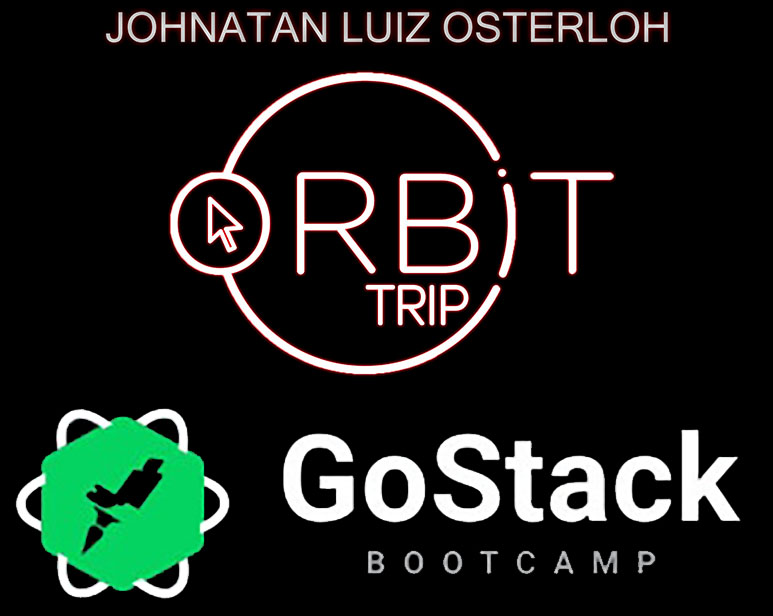

<h1 align="center">
    
    <br>
    Projeto Front-End ReactJS
    <br>
    GoStack_Level01_ChallengeReactJS
</h1>

<h4 align="center">
  Sistema desenvolvido utilizando a tecnologia ReactJS.
</h4>

<p align="center">
  <a href="#descrição">Descrição</a>&nbsp;&nbsp;&nbsp;|&nbsp;&nbsp;&nbsp;
  <a href="#tecnologias">Tecnologias</a>&nbsp;&nbsp;&nbsp;|&nbsp;&nbsp;&nbsp;
  <a href="#Como-Usar">Como Usar</a>
</p>

<p align="center">
  
</p>

## Descrição

Este projeto tem a finalidade de consumir a API desenvolvida em Node.js, demonstrando as funcionalidades da conexão do projeto Front-End no Back-End, assim como a implementação de ações nos elementos BUTTON chamando uma determinada função no onClick.
Para que este projeto possa ser compilado corretamente é necessário o projeto [GoStack_Level01_ChallengeReactNative](https://github.com/osterloh/GoStack_Level01_ChallengeReactNative) estar compilado na máquina, para poder ter acesso ao Back-End.

## Tecnologias

Este projeto foi desenvolvido no [Bootcamp GoStack da RocketSeat](https://rocketseat.com.br/bootcamp) com as seguintes tecnologias:

- [ReactJS](https://reactjs.org/)
- [Axios](https://github.com/axios/axios)
- [ReactDOM](https://pt-br.reactjs.org/docs/react-dom.html)
- [VS Code][vc]

## Como Usar

Para clonar e executar este aplicativo, você precisará [Git](https://git-scm.com), [Node.js v12.16.2][nodejs] ou superior + [Yarn 1.22.4][yarn] ou superior instalado no seu computador. Executar no seu terminal ou prompt de comando:

```bash
# Para clonar este repositório
$ git clone https://github.com/osterloh/GoStack_Level01_ChallengeReactJS.git

# Entrar no repositório
$ cd GoStack_Level01_ChallengeReactJS

# Instalar as dependências
$ yarn

#  Executar o sistema
$ yarn start
```

---

Desenvolvido por [Johnatan Luiz Osterloh](https://www.linkedin.com/in/johnatanosterloh/)

[nodejs]: https://nodejs.org/
[yarn]: https://yarnpkg.com/
[vc]: https://code.visualstudio.com/
